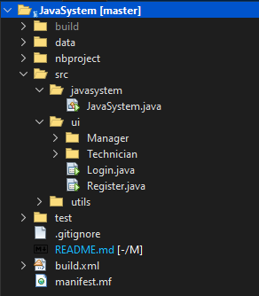
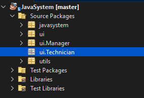

# Group 19 Java System
This Java program implements a Home Appliances Service Centre system to manage end user registration, appointment booking, payment collection, and feedback collection. The system is designed using object-oriented principles and saves data in text files.

## Project Files Hierarchy:
1. **data folder**
   - Contains text files for data storage (e.g., user information, appointments, payments).

2. **src folder**
   - **javasystem folder**
     - **JavaSystem.java**: Main class to start the application.

   - **ui folder**
     - Contains subfolders for each JFrame (Java Swing window) in the application:
       - **Login.java**: JFrame for user registration.
       - **Register.java**: JFrame for appointment booking.
       - **Manager Folder**: Folder for Manager role JFrames.
       - **Technician Folder**: Folder for Technician role JFrames.
       - etc...

   - **utils folder**
     - **CSVParser.java**: Utility class to parse CSV files.
     - **InputValidator.java**: Utility class for input validation.
     - etc...

## Files Tab View:

## Projects Tab View:

